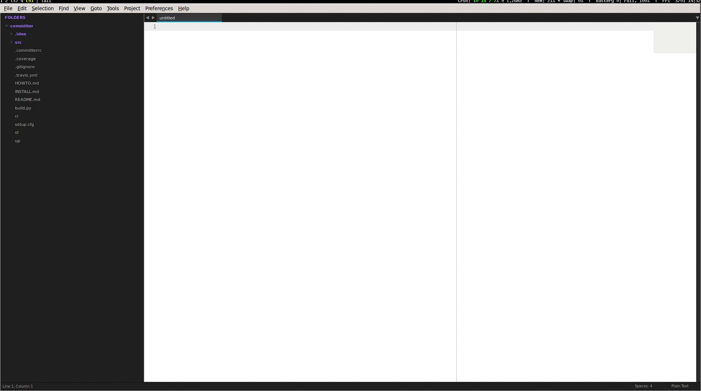

EasyPyb
=======

Sublime text 3 plugin for [PyBuilder](http://pybuilder.github.io).



## Features
* Real-time output
* Minimal configuration if you use Anaconda or SublimePythonIDE as it reuses the settings
* Does not block so you can work or check out what to do next while building.

## Installation
Clone it in your sublime text `Packages/` directory.

## Usage
Several commands will be made available to you through the command palette.
You can use them to :

* Run PyBuilder (implies default tasks)
* Run unit tests
* Analyze (lint, etc.) your project
* Publish your project
* Verify your project
* Install dependencies for your project
* Run [pyb-init](https://github.com/mriehl/pyb_init) on your project

## Configuration
EasyPyb expects two project settings to be present:

* `python_interpreter`
  This is the path to your python interpreter. Could be your system python or a virtualenv.
* `project_root`
  The root of your project where the build descriptor (`build.py`) is located.

Here's what your project settings might look like :

```
{
    "folders":
    [
        {
            "follow_symlinks": true,
            "path": "/home/mriehl/workspace/yadtshell"
        }
    ],
    "settings":
    {
        "python_interpreter": "/home/mriehl/workspace/yadtshell/venv/bin/python",
        "project_root": "/home/mriehl/workspace/yadtshell"
    }
}
```

### Special case - only if you want to work on the PyBuilder project itself!
In order to build pybuilder, you need to run a bootstrapping script.
This script must be run with the right python interpreter in order to see your packages.
Thus we need to specify the path to the bootstrapping script additionally.

My settings are:

```
{
    "folders":
    [
        {
            "follow_symlinks": true,
            "path": "/home/mriehl/workspace/pybuilder"
        }
    ],
    "settings":
    {
        "python_interpreter": "/home/mriehl/workspace/pybuilder/venv/bin/python",
        "pyb_path": "/home/mriehl/workspace/pybuilder/bootstrap",
        "project_root": "/home/mriehl/workspace/pybuilder"
    }
}
```

## License
[MIT](https://github.com/mriehl/EasyPyb/blob/master/LICENSE)
